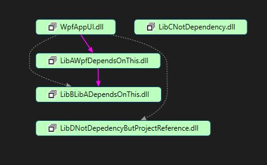

# ReadyToRun

## This Project Source Code

| Project |      Referenced Project      |  Nuget Packages |
|---|---|---|
| WpfAppUI (Main App)	|  LibAWpfDependsOnThis, LibDNotDepedencyButProjectReference | Newtonsoft.Json, Moq |
| LibAWpfDependsOnThis |    LibBLibADependsOnThis   |   Newtonsoft.Json, Castle.Core |
| LibBLibADependsOnThis |  |  Newtonsoft.Json, Azure.Core   |
| LibCNotDependency |  |     |
| LibDNotDepedencyButProjectReference | | Polly |

## Project References

## Behavior of Msbuild Publish with ReadyToRun

	- When publish a Solution: it will compile and publish all the individual projects in the solution (as explained below)
	
	- When publish a Project: it will build all the dependent projects (including nested dependencies), retrieve all the dependencies, and after that it will generate the ReadyToRun DLLs.

## Test Scenarios:

### Scenario 1: Publish Solution file

0) Run command to clean up solution: Get-ChildItem .\ -include bin,obj -Recurse | foreach ($_) { remove-item $_.fullname -Force -Recurse }

1) Run from src folder: dotnet publish -c Release -r win-x64 -p:PublishReadyToRun=true /p:DebugType=None /p:DebugSymbols=false --no-self-contained /p:PublishReadyToRunShowWarnings=true -v d

2) All projects are published, and the ReadyToRun DLLs are generated for each project.

### Scenario 2: Publish WpfAppUI project

0) Run command to clean up solution: Get-ChildItem .\ -include bin,obj -Recurse | foreach ($_) { remove-item $_.fullname -Force -Recurse }

1) Run from src\WpfAppUI: dotnet publish WpfAppUI.csproj -c Release -r win-x64 -p:PublishReadyToRun=true /p:DebugType=None /p:DebugSymbols=false --no-self-contained /p:PublishReadyToRunShowWarnings=true

2) Check that only the WpfAppUI project is published

3) The dependent project are build (Release) and the dependencies are retrieved

4) The ReadyToRun DLLs are generated for each of the DLLs (project dependencies and nuget packages).

### Scenario 3: Run the Application to see the behavior of loading the DLLs

1) Run the WpfAppUI.exe and click the buttons to load the DLLs and check DLLs loading into the process.

2) DLLs are only loaded when:

	2.1) Referenced Project with a Class being directly loaded: only when class is Loaded

	2.2) Referenced Project with a Class being dynamicaly load: when the DLL is loaded

	2.3) Not-Referenced Project with a Class being dynamicaly load: when the DLL is loaded

## Ready to Run Commands and Resources

### ReadyToRun publish command

dotnet publish -c Release -r win-x64 -p:PublishReadyToRun=true /p:DebugType=None /p:DebugSymbols=false --no-self-contained /p:PublishReadyToRunShowWarnings=true -v d

### To clean the bin folders

Get-ChildItem .\ -include bin,obj -Recurse | foreach ($_) { remove-item $_.fullname -Force -Recurse }

### To check the DLLs running for a specific process

tasklist /M /fi "IMAGENAME eq WpfAppUI.exe" /fo list | findstr "Lib"

### Resources:
	https://learn.microsoft.com/en-us/dotnet/core/deploying/ready-to-run
	https://stackoverflow.com/questions/63634280/need-i-enable-readytorun-in-each-of-my-dll-whlie-publish-the-exe-file
	https://community.devexpress.com/blogs/wpf/archive/2023/01/26/9-tips-to-reduce-wpf-app-startup-time.aspx#2-multicore-jit
	https://stackoverflow.com/questions/65618656/is-it-normal-that-ready-to-run-publishing-takes-10-times-longer
	https://github.com/dotnet/runtime/issues/47272
	https://devblogs.microsoft.com/dotnet/conversation-about-ready-to-run/
